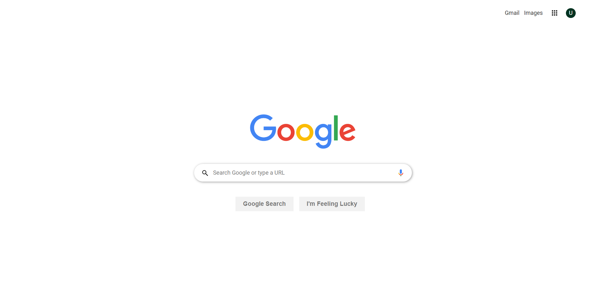

# LAP 1 Coding challenge - Nouria & Jason

## Installation & Usage

### Installation

* Clone the repo
* Run `npm install` to install dependencies at server.

### Usage

* Run `npm start` to create a live server 
* Open live server with `index.html`

## Changelog

### Client

* Input field will reponse to keywords: `dog, cat, bird`
* Error return as alert

### Server

* MVC pattern
* Express router will hold 2 api endpoint
* Base url `http://localhost:3000/search`

## Wins & Challenges

### Wins

* Clean, ordered, well-organized css style file
* Recreate google search navbar and main visual
* Complete search features
* Proper error message to instuct our users

### Challenges

* Trigger two different functions with the same input result
* Retrieve error message from api endpoint
* Put two icon in the search input field
* Place list items in navbar on the right hand side

## Key takeaway

### Server

* Use `express.static()` to render local file
* Extract req.query and put into `URLSearchParams` for restructuring
* Use `res.sendFile(path.resolve('./index.html'))` if you want to improve URL

### Client

* Could trigger two different submit action depending on `e.submitter.id`
* `window.location.origin` is the base URL (e.g.`http://localhost:3000`)
* Access URL query without request by `(new URL(document.location)).searchParams`
